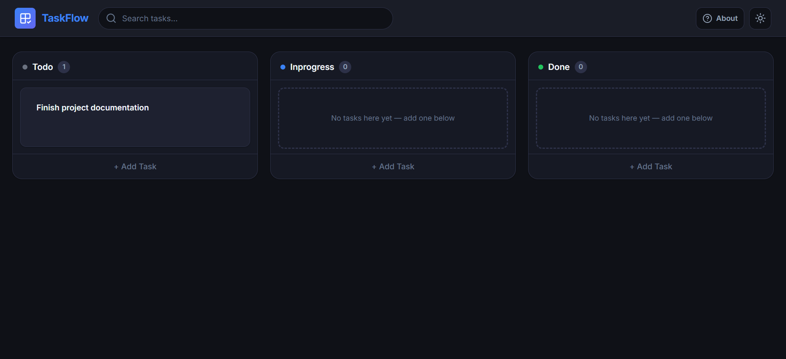
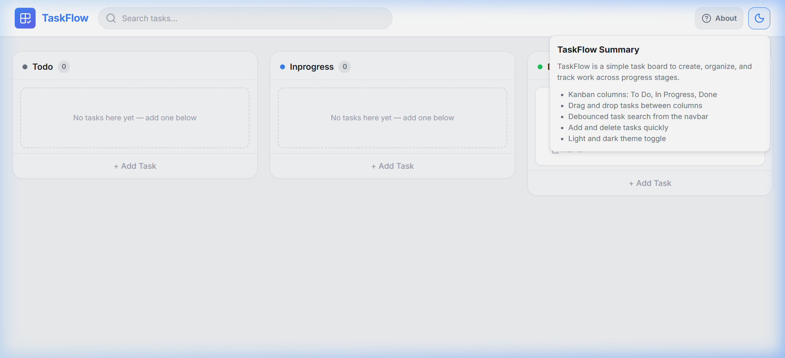
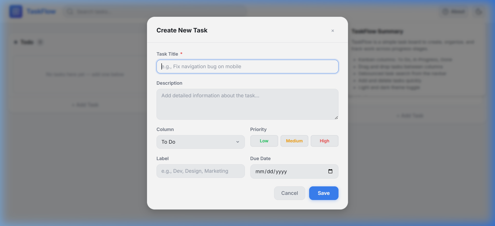
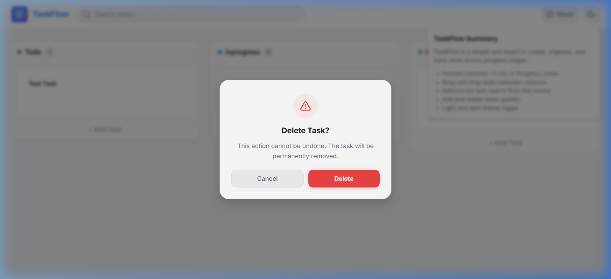
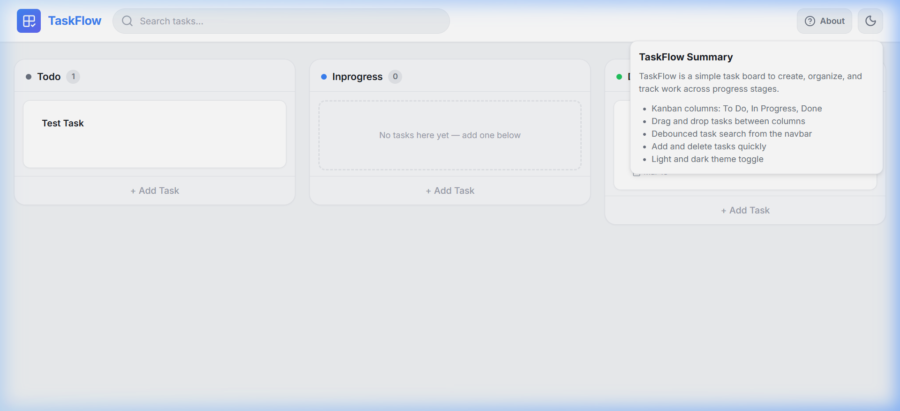

# TaskFlow - Task Manager (Kanban)

## Preview

### Board - Dark Mode



### Board - Light Mode



### Features Preview

|                Add Task Modal                 |                      Delete Confirmation                      |                  About Panel                  |
| :-------------------------------------------: | :-----------------------------------------------------------: | :-------------------------------------------: |
|  |  |  |

## Features

- Kanban workflow with 3 columns: **To Do**, **In Progress**, **Done**
- Drag-and-drop task movement between columns and between task cards
- Create, edit, and delete tasks
- Task details support:
  - Title (required)
  - Description
  - Priority (Low, Medium, High)
  - Label
  - Due date
- Debounced search from the navbar
- Theme toggle (Light / Dark)
- About panel in navbar with product summary and feature quick list
- Persistent data using `localStorage` (tasks and theme)

## Tech Stack

- React 19
- Create React App (react-scripts 5)
- DnD Kit (`@dnd-kit/core`, `@dnd-kit/sortable`, `@dnd-kit/utilities`)
- Lucide React icons
- CSS Modules
- Context API for global app state

## Project Structure

```text
src/
	components/
		Badge.jsx
		Board.jsx
		Column.jsx
		ConfirmDialog.jsx
		NavBar.jsx
		TaskCard.jsx
		TaskModel.jsx
		ReUsedComponents/
			Button.jsx
			Input.jsx
	context/
		DataProvider.jsx
		ThemeContext.jsx
	debounce/
		UseDebounce.jsx
	styles/
		*.module.css
	App.jsx
	index.js
```

## Getting Started

### Prerequisites

- Node.js 18+ (recommended)
- npm 9+ (recommended)

### Install

```bash
npm install
```

### Run in Development

```bash
npm start
```

App runs at:

```text
http://localhost:3000
```

### Build for Production

```bash
npm run build
```

### Run Tests

```bash
npm test
```

## How It Works

### State Management

`TasksProvider` in `src/context/DataProvider.jsx` manages:

- task list (`tasks`)
- filtered view (`filteredTasks`) based on search term
- add/edit modal visibility
- delete confirmation dialog visibility
- selected task id and edit task data

`ThemeProvider` in `src/context/ThemeContext.jsx` manages theme mode and syncs it to `localStorage`.

### Persistence

- Tasks are stored in browser `localStorage` under key: `tasks`
- Theme is stored in browser `localStorage` under key: `theme`

When the app loads, tasks/theme are restored automatically.

### Drag & Drop

Board drag behavior is implemented with DnD Kit in `src/components/Board.jsx` and task-level sorting in `src/components/TaskCard.jsx` + `src/components/Column.jsx`.

- Drag over a **column** to move task to that column
- Drag over a **task card** to reorder tasks and/or change column context

## Usage Guide

1. Click **+ Add Task** inside any column.
2. Fill task fields and click **Save**.
3. Drag the task using the handle icon to move it.
4. Use search in the navbar to filter by title/description.
5. Click edit icon to update a task.
6. Click delete icon to remove a task (with confirmation).
7. Use theme button to switch Light/Dark mode.
8. Click **About** in navbar actions to open app summary panel.

## Scripts

- `npm start` - Start development server
- `npm run build` - Create production build in `build/`
- `npm test` - Run tests
- `npm run eject` - Eject CRA config (irreversible)

## Notes

- If your board appears empty on first launch, this is expected when no tasks exist in `localStorage` yet.
- Clearing browser storage resets all tasks and theme preference.

## Future Improvements (Optional)

- Due date reminders
- Task assignees and avatars
- Filters by priority/label
- Backend sync (multi-device support)

## Author

- [Abduselam Seid aka(Afis)](https://github.com/afisphbl)

## License

This project is currently unlicensed for public reuse. Add a license file if you plan to distribute it.
